# Ottabase Architecture

This document describes the architecture of the Ottabase monorepo and the runtime model used by the primary app
template.

## Goals

- Edge-first runtime on Cloudflare Workers
- Fat-model domain design via OttaORM
- Multi-package modularity in a single pnpm monorepo
- Config-driven package enablement (tables + routes + migrations)
- Tenant-aware access control (RBAC + RLS)

## Monorepo Topology

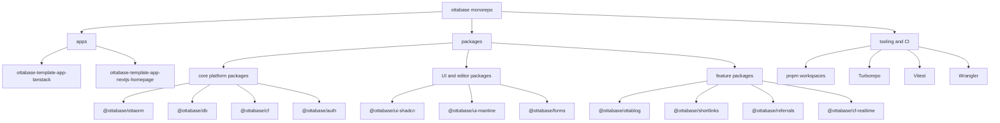

## Package Dependency Layers

Packages follow a strict layering model. Lower layers must never depend on higher layers.

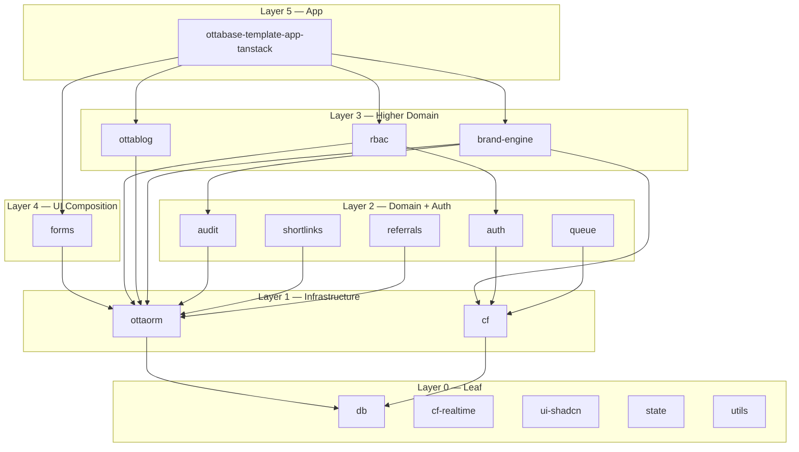

**Dependency direction:** arrows point downward (from consumer to dependency). Packages may only depend on the same or a
lower layer.

**Rules:**

- Circular dependencies between packages are forbidden.
- UI packages (`ui-shadcn`, `ui-mantine`, `state`) have zero `@ottabase/*` dependencies — they are leaf packages.
- `@ottabase/db` is the lowest data layer; `@ottabase/ottaorm` depends on it, not the reverse.
- Feature packages (`shortlinks`, `referrals`, `ottablog`) depend on `ottaorm` for persistence but not on each other.

## Runtime Architecture (Primary App)

Primary app: `apps/ottabase-template-app-tanstack`

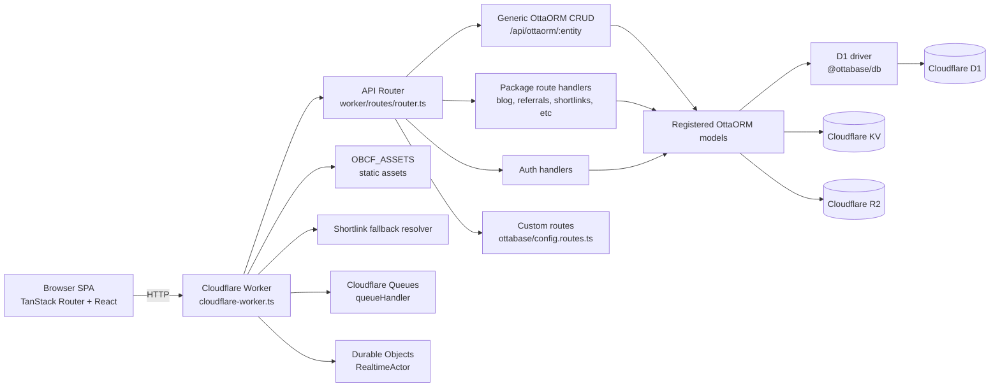

## Deployment Topology

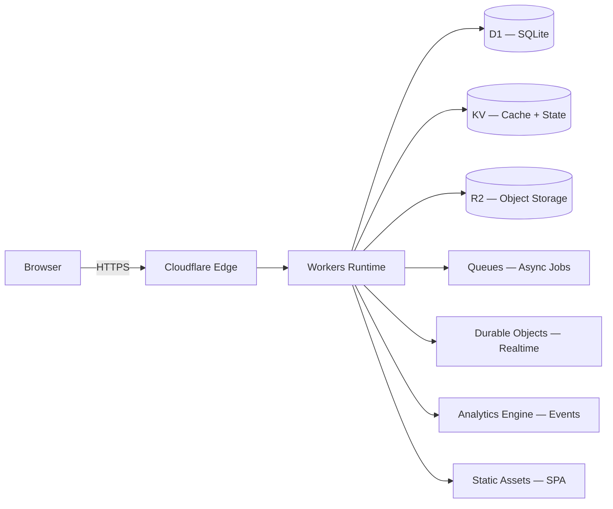

All infrastructure is Cloudflare-native. There are no external databases, Redis instances, or third-party services
required for core operation. Binding names use the `OBCF_*` prefix (`OBCF_D1`, `OBCF_KV`, `OBCF_R2`, `OBCF_QUEUE`,
`OBCF_REALTIME`, `OBCF_RATE_LIMITER`).

## Request Lifecycle

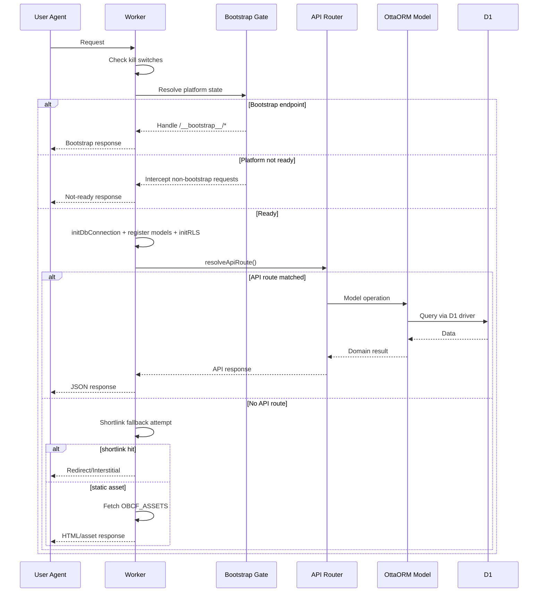

## Security and Isolation

### Worker-Level Gates

Every request passes through two gates before reaching application logic:

1. **Kill switches** — checked first via `checkKillSwitches(request, env)`:
    - `KILLSWITCH_LOCKDOWN`: returns `503` for all requests (full lockdown).
    - `KILLSWITCH_READONLY_MODE`: blocks `POST`, `PUT`, `PATCH`, `DELETE` with `503` (read-only mode).

2. **Bootstrap gate** — `resolvePlatformState(env)` determines if the platform is `READY`:
    - `/__bootstrap__/*` paths are always handled (init, seed, create-owner, finalize).
    - All other requests are intercepted with a "not ready" response until bootstrap completes.

### CORS

CORS is centralized in the worker entry. The `Origin` header is read (defaulting to `*`), and all API responses include
`Access-Control-Allow-Credentials: true`, allowed methods (`GET, POST, PUT, PATCH, DELETE, OPTIONS`), and
`Vary: Origin`.

### Auth Flow

Authentication uses Auth.js v5 (`@ottabase/auth`) with session resolution **per route**, not globally:

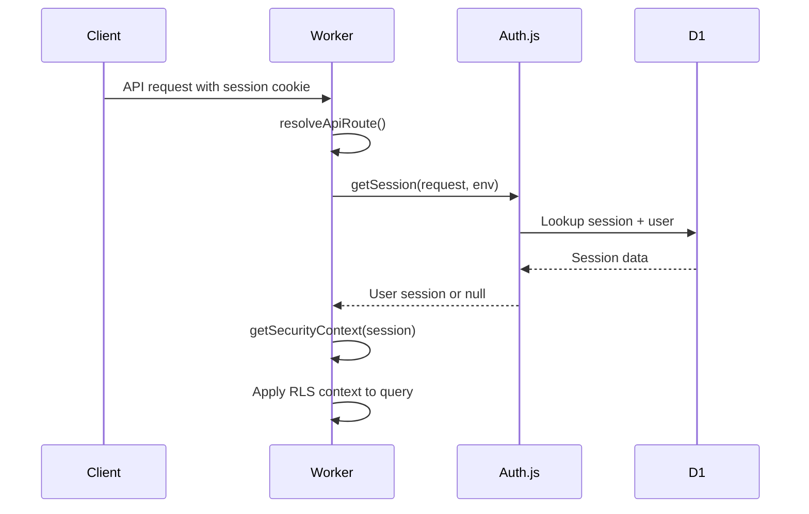

Session cookies are `HttpOnly` and `Secure`. OAuth providers (Google, GitHub) and credentials are supported. Auth routes
live at `/api/auth/*` and are handled by `handleAuthJsRequest`.

### Row-Level Security (RLS)

RLS enforces data isolation at the OttaORM layer. `initRLS()` registers policies for every model so that queries are
automatically filtered by security context (`userId`, `organizationId`, `appId`).

**Policy types:** `TenantScoped`, `UserScoped`, `AppScoped`, `PublicReadOnly`, `AdminOnly`, `PermissionBased`,
`OwnerOnly`, `Hierarchical`, and custom filter functions.

**Pre-registered policies (subset):**

| Model                         | Policy                    | Filter field     |
| ----------------------------- | ------------------------- | ---------------- |
| `organizations`               | Custom (owner/membership) | `organizationId` |
| `organization_members`        | Tenant-scoped             | `organizationId` |
| `roles`, `permissions`        | Tenant-scoped             | `organizationId` |
| `users`                       | Owner-only                | `id`             |
| `accounts`, `sessions`        | User-scoped               | `userId`         |
| `posts`, `tags`, `shortlinks` | App-scoped                | `appId`          |
| `audit_logs`                  | Tenant-scoped (read-only) | `organizationId` |
| `system_config`               | Admin-only                | —                |

Cross-tenant writes are blocked and logged automatically. See
[RBAC_MULTI_TENANT_GUIDE.md](./docs/RBAC_MULTI_TENANT_GUIDE.md) for the full policy list and configuration.

## Multi-Tenancy Model

Ottabase supports both multi-tenant SaaS and single-founder modes.

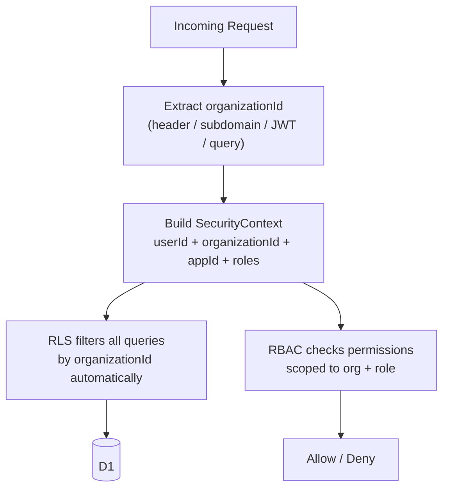

**Key properties:**

- `organizationId` is extracted from `X-Org-Id` header, subdomain, JWT claim, or query parameter (priority order).
- All tenant-scoped models include an `organizationId` column. RLS injects this filter automatically.
- RBAC roles and permissions are scoped per organization. A user can be `admin` in one org and `member` in another.
- Caching (`@ottabase/rbac`) uses per-org KV keys with O(1) invalidation.
- `allowNullTenant: true` enables single-founder mode (no organization required).
- Cross-tenant data access returns `403 Forbidden` and is logged to `audit_logs`.

## Frontend-to-Backend Integration

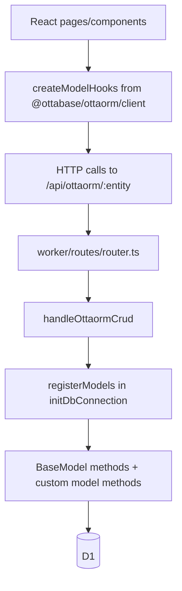

## Data Architecture

### Core Data Model

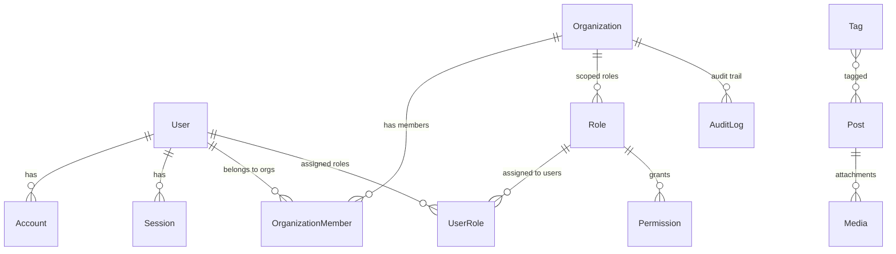

**Core models** (from `@ottabase/ottaorm`): `User`, `Account`, `Session`, `Authenticator`, `VerificationToken`,
`Organization`, `OrganizationMember`, `Role`, `Permission`, `UserRole`, `AuditLog`, `ScheduledTask`, `Tag`, `Media`.

**Package models** (owned by feature packages): `Post`, `Category`, `Series` (`@ottabase/ottablog`), `Shortlink`
(`@ottabase/shortlinks`), `ReferralTracking` (`@ottabase/referrals`), `Comment` (`@ottabase/comments`).

### Schema Sources

`getAllSchemas()` combines three schema sources into one runtime migration payload:

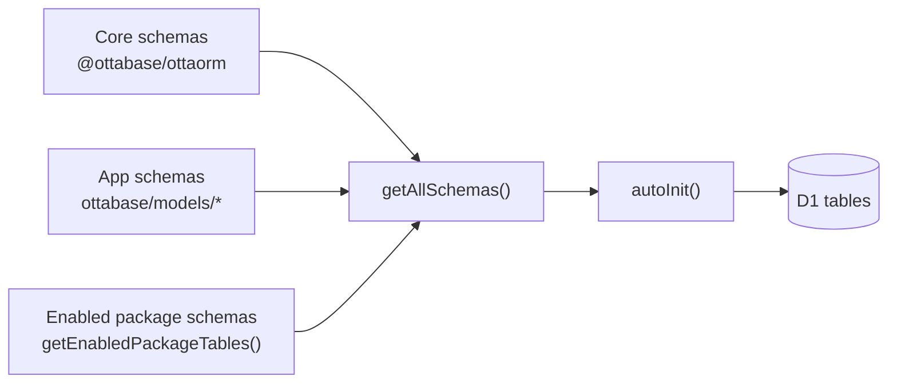

### Package Registry and Migrations

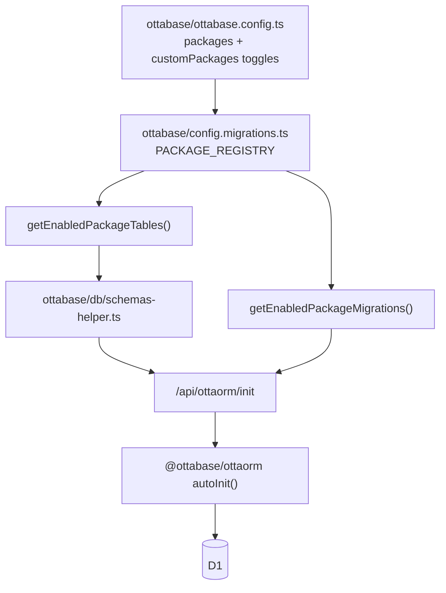

## Model and Domain Layer

Ottabase follows a fat-model design:

- Persistence logic stays in model classes (`BaseModel` descendants)
- Domain actions live as model methods (`toggle()`, `activate()`, etc.)
- Route handlers stay thin (auth/validation/orchestration)
- Generic CRUD API delegates behavior to registered models

### BaseModel API Surface

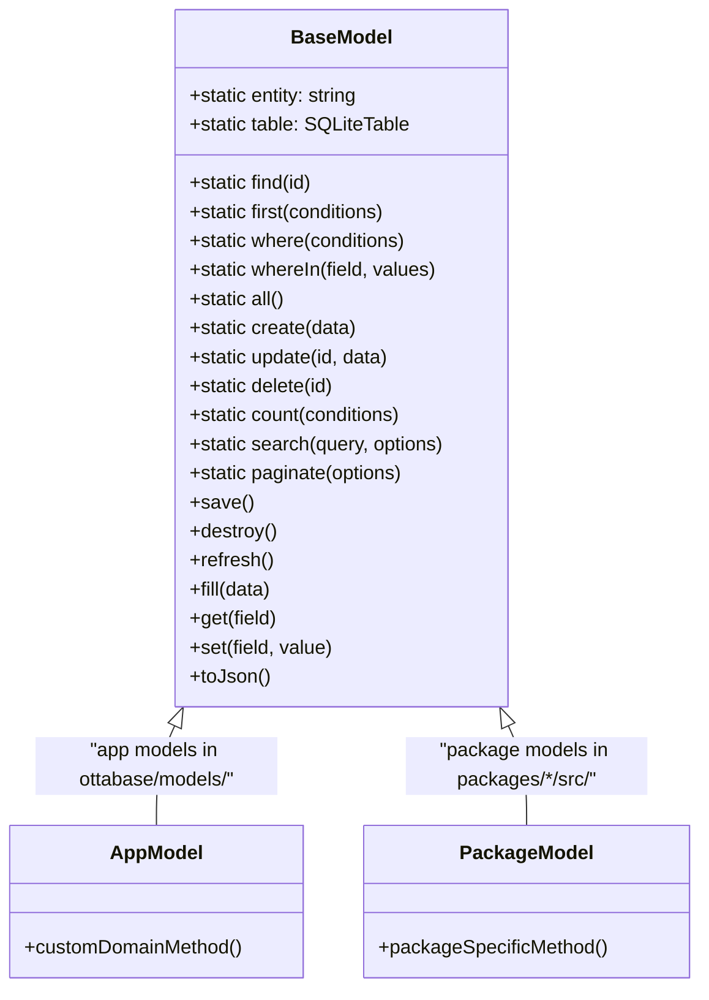

**Relationship methods** (protected, used inside model classes): `belongsTo()`, `hasMany()`, `hasOne()`,
`belongsToMany()`. These use dynamic imports to avoid circular dependencies.

**Additional static methods**: `withTrashed()`, `onlyTrashed()`, `forceDelete()`, `restore()`, `isUnique()`,
`searchPaginate()`, `batch()`, `loadAll()`, `validate()`, `getFields()`.

## Error Handling and Observability

- **API errors** use `errorResponse(...)` from `@ottabase/utils/http-errors` for consistent JSON error responses with
  status codes and error codes.
- **Structured logging** via `@ottabase/logger` supports Console, HTTP, Sentry, Memory, and Buffer transports.
- **Audit logging** via `@ottabase/audit` records `create`, `update`, `delete`, `auth`, `role-assign`, and `failure`
  events with full context (userId, organizationId, appId, IP, user agent, before/after diffs).
- **RLS violations** are logged automatically with the blocked query context.

## Build and Execution Pipeline

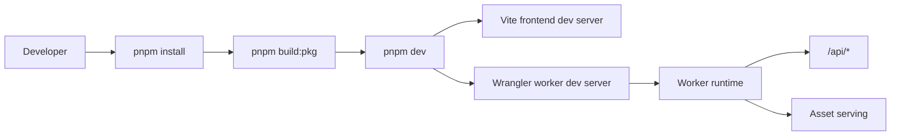

## Key File Map

- Worker entrypoint: `apps/ottabase-template-app-tanstack/cloudflare-worker.ts`
- API router: `apps/ottabase-template-app-tanstack/worker/routes/router.ts`
- DB init and model registration: `apps/ottabase-template-app-tanstack/worker/lib/db-utils.ts`
- App config: `apps/ottabase-template-app-tanstack/ottabase/ottabase.config.ts`
- Schema collector: `apps/ottabase-template-app-tanstack/ottabase/db/schemas-helper.ts`
- Package migration registry: `apps/ottabase-template-app-tanstack/ottabase/config.migrations.ts`

## Architecture Decisions

### ADR-1: Monorepo-first distribution

**Context:** Ottabase ships as a set of tightly integrated packages (ORM, auth, RBAC, UI, blog, etc.). Publishing each
as an independent npm package would create version skew and complex integration testing.

**Decision:** Distribute as a monorepo that consumers clone and modify. Internal packages use `workspace:*` references.

**Consequences:** Integration changes are synchronized atomically. Consumers own their fork and are responsible for
merging upstream changes. Trade-off: higher coupling, but version skew is eliminated.

### ADR-2: OttaORM as the domain center (fat models over services)

**Context:** SaaS apps accumulate business logic. The common MVC pattern scatters logic across controllers, services,
and repositories — making it hard to find and maintain.

**Decision:** All domain logic lives in `BaseModel` subclasses (Active Record pattern). Route handlers stay thin (auth +
validation + orchestration). There is no service layer.

**Consequences:** Models are self-contained and testable. Complex cross-model orchestration may bloat individual models
over time. Mitigation: use model composition and keep methods focused on single-entity behavior.

### ADR-3: Config-driven package composition

**Context:** Different apps need different feature sets. A blog app doesn't need shortlinks; an analytics dashboard
doesn't need the blog.

**Decision:** Package tables, routes, and migrations are toggled via `ottabase.config.ts` (`packages` and
`customPackages`). `PACKAGE_REGISTRY` in `config.migrations.ts` maps enabled packages to their schemas and migrations.

**Consequences:** Smaller app footprints without forking the runtime. Adding a new package requires registration in
config + registry + model registry (`db-utils.ts`), not code changes to the core framework.

### ADR-4: Edge-native primitives by default

**Context:** Traditional SaaS stacks use Node.js servers with external databases (Postgres, Redis, S3). This requires
managing servers, connection pools, and multi-region replication.

**Decision:** Build on Cloudflare Workers with D1 (SQLite), KV, R2, Queues, and Durable Objects as first-class
primitives. No Node.js-only APIs in app/package code.

**Consequences:** Global edge execution with minimal cold starts. Cost-predictable infrastructure. Trade-off: vendor
lock-in to Cloudflare (acknowledged in README). D1 is SQLite-based, so some Postgres features (e.g., JSONB operators,
full-text search) are unavailable.

### ADR-5: Row-Level Security at the ORM layer

**Context:** Multi-tenant apps must prevent cross-tenant data leaks. Manual `WHERE organizationId = ?` filtering in
every query is error-prone and easy to forget.

**Decision:** Implement RLS as an OttaORM middleware that automatically injects tenant/user/app filters into all queries
based on a `SecurityContext`. Policies are registered per model via `registerPolicy()` and activated by `initRLS()`.

**Consequences:** Data isolation is enforced by default — developers cannot accidentally query across tenants.
Violations are blocked and logged. Trade-off: every query incurs a small overhead for policy evaluation. Custom queries
that bypass OttaORM (raw SQL) are not protected by RLS.

## Limits and Future Evolution

Current constraints to keep in mind:

- Feature enablement is app-config driven; package interoperability testing must remain strong.
- Some package domains are tightly coupled to Cloudflare bindings.
- Cross-package release management is simpler in-monorepo but requires strong CI discipline.
- D1 is SQLite-based: no stored procedures, limited concurrent write throughput, no native full-text search.
- Raw Drizzle queries bypass RLS — use BaseModel methods for all tenant-scoped data access.

Potential evolutions:

- Additional architecture decision records for major changes
- Separate C4-style docs for package internals
- Expanded sequence diagrams per major route family (auth/blog/realtime)
