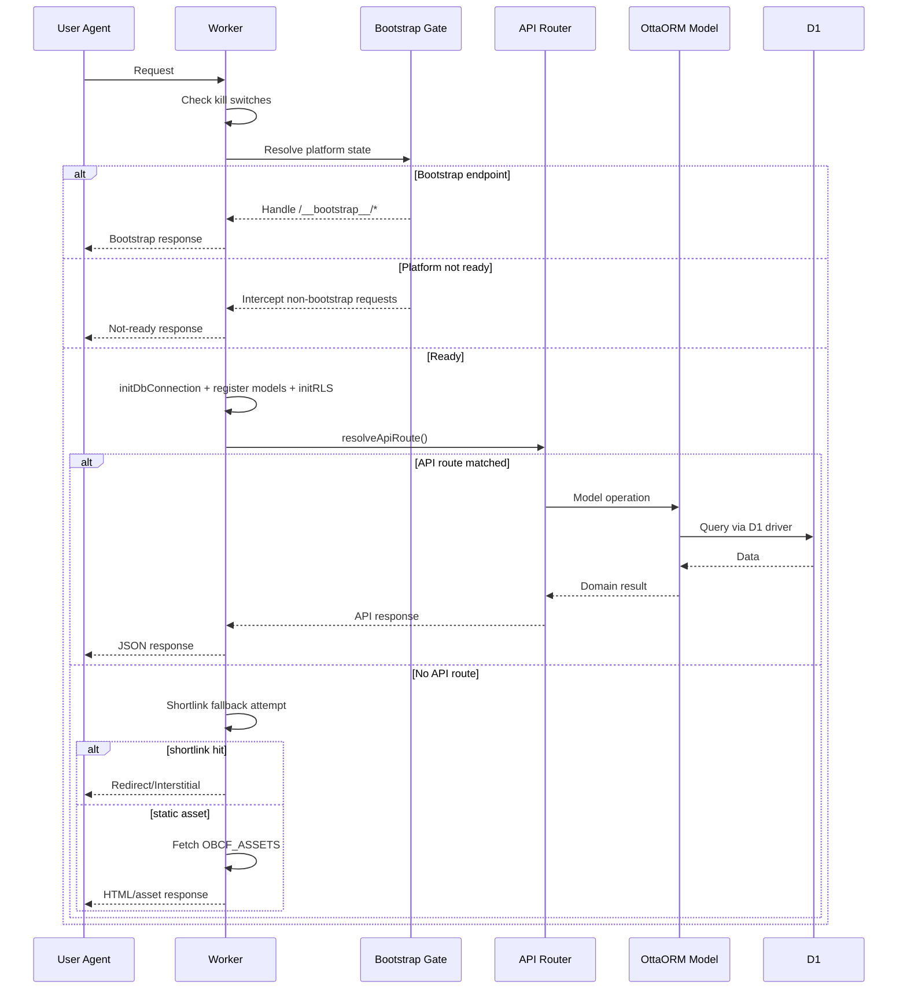
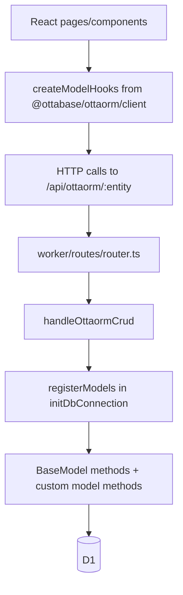
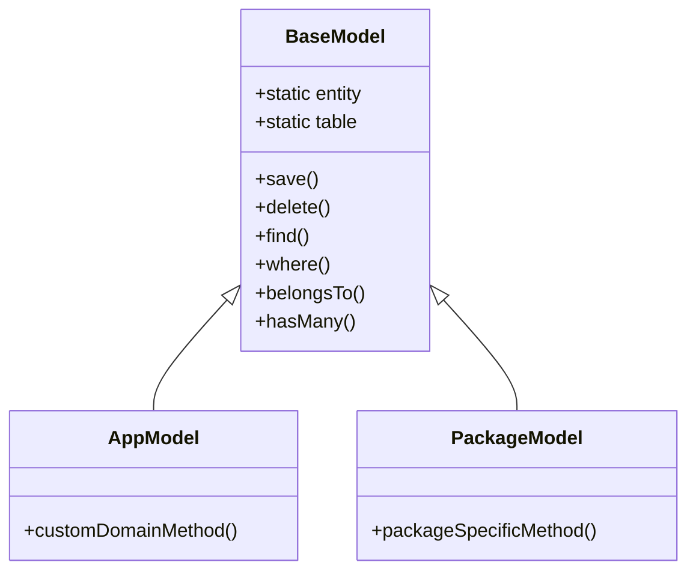

# Ottabase Architecture

This document describes the architecture of the Ottabase monorepo and the runtime model used by the primary app
template.

## Goals

- Edge-first runtime on Cloudflare Workers
- Fat-model domain design via OttaORM
- Multi-package modularity in a single pnpm monorepo
- Config-driven package enablement (tables + routes + migrations)
- Tenant-aware access control (RBAC + RLS)

## Monorepo Topology

```mermaid
flowchart TB
    Root[ottabase monorepo]

    Root --> Apps[apps]
    Root --> Packages[packages]
    Root --> Tooling[tooling and CI]

    Apps --> TanStack[ottabase-template-app-tanstack]
    Apps --> Homepage[ottabase-template-app-nextjs-homepage]

    Packages --> Core[core platform packages]
    Packages --> UI[UI and editor packages]
    Packages --> Feature[feature packages]

    Core --> OttaORM[@ottabase/ottaorm]
    Core --> DB[@ottabase/db]
    Core --> CF[@ottabase/cf]
    Core --> Auth[@ottabase/auth]

    UI --> Shadcn[@ottabase/ui-shadcn]
    UI --> Mantine[@ottabase/ui-mantine]
    UI --> Forms[@ottabase/forms]

    Feature --> Blog[@ottabase/ottablog]
    Feature --> Shortlinks[@ottabase/shortlinks]
    Feature --> Referrals[@ottabase/referrals]
    Feature --> Realtime[@ottabase/cf-realtime]

    Tooling --> PNPM[pnpm workspaces]
    Tooling --> Turbo[Turborepo]
    Tooling --> Vitest[Vitest]
    Tooling --> Wrangler[Wrangler]
```

## Runtime Architecture (Primary App)

Primary app: `apps/ottabase-template-app-tanstack`

```mermaid
flowchart LR
    Browser[Browser SPA\nTanStack Router + React] -->|HTTP| Worker[Cloudflare Worker\ncloudflare-worker.ts]

    Worker --> Router[API Router\nworker/routes/router.ts]
    Worker --> Assets[OBCF_ASSETS\nstatic assets]
    Worker --> ShortlinkFallback[Shortlink fallback resolver]

    Router --> Auth[Auth handlers]
    Router --> CRUD[Generic OttaORM CRUD\n/api/ottaorm/:entity]
    Router --> PackageRoutes[Package route handlers\n(blog/referrals/shortlinks/etc)]
    Router --> CustomRoutes[Custom routes\nottabase/config.routes.ts]

    Worker --> Queue[Cloudflare Queues\nqueueHandler]
    Worker --> DO[Durable Objects\nRealtimeActor]

    CRUD --> Models[Registered OttaORM models]
    PackageRoutes --> Models
    Auth --> Models

    Models --> Driver[D1 driver\n@ottabase/db]
    Driver --> D1[(Cloudflare D1)]

    Models --> KV[(Cloudflare KV)]
    Models --> R2[(Cloudflare R2)]
```

## Request Lifecycle



## Frontend-to-Backend Integration



## Data Architecture

### Schema Sources

`getAllSchemas()` combines three schema sources into one runtime migration payload:

```mermaid
flowchart LR
    Core[Core schemas\n@ottabase/ottaorm] --> All[getAllSchemas()]
    App[App schemas\nottabase/models/*] --> All
    Pkg[Enabled package schemas\ngetEnabledPackageTables()] --> All
    All --> AutoInit[autoInit()]
    AutoInit --> D1[(D1 tables)]
```

### Package Registry and Migrations

```mermaid
flowchart TD
    Config[ottabase/ottabase.config.ts\npackages + customPackages toggles] --> Registry[ottabase/config.migrations.ts\nPACKAGE_REGISTRY]

    Registry --> Tables[getEnabledPackageTables()]
    Registry --> Migrations[getEnabledPackageMigrations()]

    Tables --> SchemasHelper[ottabase/db/schemas-helper.ts]
    SchemasHelper --> Init[/api/ottaorm/init]
    Migrations --> Init

    Init --> AutoInit[@ottabase/ottaorm autoInit()]
    AutoInit --> D1[(D1)]
```

## Model and Domain Layer

Ottabase follows a fat-model design:

- Persistence logic stays in model classes (`BaseModel` descendants)
- Domain actions live as model methods (`toggle()`, `activate()`, etc.)
- Route handlers stay thin (auth/validation/orchestration)
- Generic CRUD API delegates behavior to registered models



## Security and Isolation

### Runtime Controls

- Kill-switch checks run at the start of request handling
- Bootstrap gate enforces platform readiness before normal traffic
- CORS handling is centralized in worker request flow

### Auth and Access Controls

- Auth handlers operate through app-level routes
- RBAC tables are part of core schema set (roles, permissions, user_roles)
- `initRLS()` is called during DB initialization to enforce row-level rules
- Organization-scoped access is enforced through RLS/RBAC context

## Cloudflare Bindings Model

The system is designed around Cloudflare-native primitives:

- D1 for relational data
- KV for caching and key-value state
- R2 for object storage
- Queues for async jobs
- Durable Objects for realtime channels
- Static asset binding for SPA delivery

## Build and Execution Pipeline

```mermaid
flowchart LR
    Dev[Developer] --> Install[pnpm install]
    Install --> BuildPkg[pnpm build:pkg]
    BuildPkg --> DevRun[pnpm dev]

    DevRun --> Vite[Vite frontend dev server]
    DevRun --> WranglerDev[Wrangler worker dev server]

    WranglerDev --> WorkerRuntime[Worker runtime]
    WorkerRuntime --> Api[/api/*]
    WorkerRuntime --> Assets[Asset serving]
```

## Key File Map

- Worker entrypoint: `apps/ottabase-template-app-tanstack/cloudflare-worker.ts`
- API router: `apps/ottabase-template-app-tanstack/worker/routes/router.ts`
- DB init and model registration: `apps/ottabase-template-app-tanstack/worker/lib/db-utils.ts`
- App config: `apps/ottabase-template-app-tanstack/ottabase/ottabase.config.ts`
- Schema collector: `apps/ottabase-template-app-tanstack/ottabase/db/schemas-helper.ts`
- Package migration registry: `apps/ottabase-template-app-tanstack/ottabase/config.migrations.ts`

## Architecture Decisions

1. Monorepo-first distribution

- The template app composes many internal packages via `workspace:*`.
- This keeps integration changes synchronized and reduces version skew.

1. OttaORM as the domain center

- Model classes own data behavior and relationships.
- Reduces service/controller sprawl.

1. Config-driven package composition

- Package routes, tables, and migrations are enabled by configuration.
- Supports smaller app footprints without forking core runtime.

1. Edge-native primitives by default

- Cloudflare capabilities are first-class, not adapters bolted onto Node-first code.

## Limits and Future Evolution

Current constraints to keep in mind:

- Feature enablement is app-config driven; package interoperability testing must remain strong.
- Some package domains are tightly coupled to Cloudflare bindings.
- Cross-package release management is simpler in-monorepo but requires strong CI discipline.

Potential evolutions:

- Additional architecture decision records for major changes
- Separate C4-style docs for package internals
- Expanded sequence diagrams per major route family (auth/blog/realtime)
