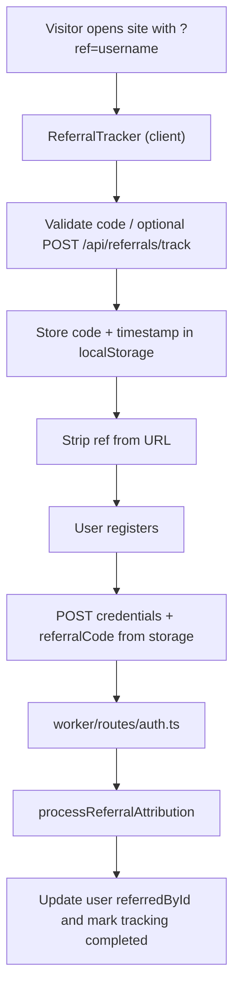

# Referral system

Documentation for inbound referral tracking, first-touch attribution, and signup conversion in the Ottabase monorepo.

## Table of contents

1. [Overview](#overview)
2. [Architecture](#architecture)
3. [Repository layout](#repository-layout)
4. [Database schema](#database-schema)
5. [API endpoints](#api-endpoints)
6. [Configuration](#configuration)
7. [Client implementation](#client-implementation)
8. [Server implementation](#server-implementation)
9. [Signup integration](#signup-integration)
10. [Validation rules](#validation-rules)
11. [Browser storage](#browser-storage)
12. [Behavior](#behavior)
13. [Testing checklist](#testing-checklist)
14. [Production considerations](#production-considerations)
15. [Deployment](#deployment)
16. [Troubleshooting](#troubleshooting)
17. [Future enhancements](#future-enhancements)

---

## Overview

The referral system is framework-agnostic at the package level: it tracks referral links, stores the first valid
referrer for a visitor, records clicks (optional), and attributes new accounts to referrers. It exposes REST handlers,
an OttaORM model, and template-app UI (tracker, dashboard, registration).

**Capabilities**

- First-touch attribution (first valid referral code wins for the configured window)
- Configurable expiry for stored referral codes (default: 90 days)
- Click tracking with request metadata (IP, user agent, UTM, referer) when enabled
- Conversion path from pending tracking to completed on signup
- User-managed referral usernames
- Dashboard with stats and activity
- REST API for tracking, stats, username updates, and listing records

---

## Architecture

End-to-end flow:



**Storage model**

- **D1**: users (referral fields), `referral_tracking` rows for clicks and conversions
- **localStorage**: short-lived referral code and timestamp (no KV required for the default template)

---

## Repository layout

| Area                                | Path                                                                                               |
| ----------------------------------- | -------------------------------------------------------------------------------------------------- |
| Package (schema, model, validation) | `packages/referrals/`                                                                              |
| Worker API                          | `apps/otta-web/worker/routes/referrals.ts`                                                         |
| Router wiring                       | `apps/otta-web/worker/routes/router.ts`                                                            |
| Signup attribution                  | `apps/otta-web/worker/routes/auth.ts` (calls `processReferralAttribution`)                         |
| Attribution helper                  | `apps/otta-web/ottabase/helpers/referral-attribution.ts`                                           |
| Client utilities                    | `apps/otta-web/src/lib/referrals.ts`                                                               |
| Tracker component                   | `apps/otta-web/src/components/ReferralTracker.tsx`                                                 |
| Layout mount                        | `ConfigurableLayout` / `BrandLayout` (renders `ReferralTracker` when `PACKAGES_ENABLED.referrals`) |
| Dashboard page                      | `apps/otta-web/src/pages/referrals/ReferralsPage.tsx`                                              |
| Dashboard UI                        | `apps/otta-web/src/components/ReferralDashboard.tsx`                                               |
| App config                          | `apps/otta-web/ottabase/ottabase.config.ts` (`features.referrals`, `packages.referrals`)           |
| Resolved client config              | `apps/otta-web/ottabase/config.loader.ts` (`REFERRALS_CONFIG`)                                     |
| Model registration                  | `apps/otta-web/worker/lib/db-utils.ts` (includes `ReferralTracking` when package enabled)          |

---

## Database schema

### `User` (OttaORM core)

Referral-related columns (see `packages/ottaorm` user model):

- `referralUsername` — unique public handle used in links
- `referredById` — optional FK-style id of the referring user

Typical helpers: find by referral username, load referrer / referred users (see model API in-repo).

### `referral_tracking`

Defined in `packages/referrals/src/schema.ts` and used by the `ReferralTracking` model from `@ottabase/referrals`.

Conceptual fields:

| Field                               | Role                                       |
| ----------------------------------- | ------------------------------------------ |
| `id`                                | Primary key                                |
| `userId`                            | Referrer (owner of the code at click time) |
| `referralCode`                      | Username / code at time of click           |
| `referredUserId`                    | Set when conversion completes              |
| `status`                            | `pending`, `completed`, or `invalid`       |
| `ipAddress`, `userAgent`, `referer` | Request context                            |
| `meta`                              | JSON (e.g. UTM payload)                    |
| `createdAt`                         | Click time                                 |
| `conversionAt`                      | Set on successful signup attribution       |

Indexes should support lookups by `userId`, `referralCode`, `status`, and `referredUserId` (see package schema for exact
definitions).

---

## API endpoints

Handlers live under the template app worker; paths below are relative to the worker origin.

### `POST /api/referrals/track`

Records a click when click tracking is enabled.

**Request body (JSON)**

```json
{
    "referralCode": "johndoe",
    "referer": "https://twitter.com/...",
    "meta": {
        "utm": {
            "source": "twitter",
            "campaign": "launch"
        }
    }
}
```

**Responses**

- `200` — tracking row created
- `404` — unknown referral username (no row created)

Server enriches IP and user agent from the incoming request where applicable.

### `GET /api/referrals/stats?userId={userId}`

Returns aggregate counts (e.g. total / completed / pending) for the referrer.

### `GET /api/referrals/user?userId={userId}`

Returns user profile slice, stats, and tracking rows for the dashboard.

### `PUT /api/referrals/username`

Updates the caller’s referral username with validation (length, charset, uniqueness).

### `GET /api/referrals/tracking?userId={userId}&status=&page=&perPage=`

Paginated list of tracking rows with optional `status` filter.

### Registration and attribution

Credential registration is handled in `worker/routes/auth.ts`. The client sends `referralCode` when present; the worker
runs `processReferralAttribution` after the user is created. Response may include an `referralAttribution` summary (see
route implementation for the exact shape).

---

## Configuration

Referral behavior is controlled in **`apps/otta-web/ottabase/ottabase.config.ts`**.

1. **Package gate** — `packages.referrals: true | false` controls whether referral routes and the `ReferralTracking`
   model are registered.
2. **Feature flags** — `features.referrals`:

```typescript
features: {
    referrals: {
        enabled: true,       // Master switch (tracker + client storage behavior)
        trackClicks: true,   // POST /api/referrals/track on visit
        expiryDays: 90,      // localStorage validity window
    },
},
```

| Option        | Type      | Default | Purpose                                                                       |
| ------------- | --------- | ------- | ----------------------------------------------------------------------------- |
| `enabled`     | `boolean` | `true`  | Disables tracker and storage when `false`                                     |
| `trackClicks` | `boolean` | `true`  | When `false`, skips click API calls; code may still be stored for attribution |
| `expiryDays`  | `number`  | `90`    | Expired codes are cleared client-side                                         |

The client reads **`REFERRALS_CONFIG`** from `ottabase/config.loader.ts` (derived from the same file).

---

## Client implementation

### Automatic tracking

`ReferralTracker` is mounted from **`ConfigurableLayout`** / **`BrandLayout`** when `PACKAGES_ENABLED.referrals` is
true. It:

1. Respects `features.referrals.enabled`
2. Reads `?ref=` from the URL
3. Applies first-touch rules and expiry
4. Optionally calls `/api/referrals/track` when `trackClicks` is true
5. Normalizes the URL (removes `ref`)

You normally do **not** add the tracker to `router.tsx` manually unless you use a custom layout.

### Dashboard

Protected UI: `ReferralDashboard` on `ReferralsPage` (`/referrals`). Shows stats, username editor, share link, and
recent activity.

### Utilities (`src/lib/referrals.ts`)

- `getStoredReferralCode()` / `storeReferralCode` / `clearStoredReferralCode`
- `trackReferralClick`, `extractUtmParams`, `cleanReferralFromUrl`
- `getReferralExpiryInfo()` for UI countdowns

---

## Server implementation

### `processReferralAttribution`

Import from `ottabase/helpers/referral-attribution.ts`. The template wires it from **`worker/routes/auth.ts`** after
registration.

Typical inputs: `newUserId`, `referralCode`, `ipAddress`, `userAgent`, `referer`, `meta`.

Responsibilities:

1. Ignore empty or invalid codes
2. Resolve referrer by `referralUsername`
3. Set `referredById` on the new user
4. Create or update `ReferralTracking` as **completed** with full context
5. Reject self-referral

### `ReferralTracking` model (`@ottabase/referrals`)

Use package methods for queries and stats (`forUser`, `getStats`, `findPendingByCode`, `recentConversions`, instance
helpers such as `markCompleted` / `markInvalid`, etc.). See package source and tests for signatures.

---

## Signup integration

`RegisterPage` loads the stored code, shows referrer messaging and expiry, and posts `referralCode` with the
registration payload. Server-side attribution is already integrated in the template’s auth route; for other auth flows,
call `processReferralAttribution` in the same way with data from the client or session.

---

## Validation rules

Usernames are validated in `@ottabase/referrals` (see `validation.ts`):

- Length: 3–20 characters
- Charset: letters, digits, underscore (`a-z`, `A-Z`, `0-9`, `_`)
- Uniqueness enforced at update time

```typescript
import { validateReferralUsername } from '@ottabase/referrals';

const result = validateReferralUsername('john_doe123');
if (!result.valid) {
    console.error(result.error);
}
```

---

## Browser storage

Keys used by the template client (`src/lib/referrals.ts`):

| Key                           | Purpose                         |
| ----------------------------- | ------------------------------- |
| `ottabase.referral-code`      | Active referral code            |
| `ottabase.referral-timestamp` | Stored at write time for expiry |

Values honor `features.referrals.expiryDays`. Clearing or private browsing behaves like any other `localStorage`
feature.

---

## Behavior

### First-touch

After a valid code is stored, later `?ref=` values are ignored until expiry or manual clear.

### Expiry

Expired entries are removed client-side and are not returned from `getStoredReferralCode()`.

### Invalid `?ref=`

Invalid codes do not persist; the track endpoint returns an error and nothing is written to storage.

### Username changes

Old links stop resolving to the user; pending rows tied to the old code may not convert. Completed rows keep historical
data. The dashboard should warn when changing username.

---

## Testing checklist

**Core flow**

- [ ] Visit with `?ref=` valid username → code stored, URL cleaned
- [ ] Second visit with different `?ref=` → first code still wins
- [ ] Confirm localStorage keys and timestamps
- [ ] With `trackClicks: true`, pending row in D1
- [ ] Register → `referredById` set, tracking row completed
- [ ] Dashboard stats and list match expectations
- [ ] Username update validates and persists
- [ ] Invalid code → no storage / API error as designed
- [ ] Expired timestamp path clears storage

**Configuration**

- [ ] `enabled: false` → tracker inert
- [ ] `trackClicks: false` → no track POST; signup attribution still works if code present
- [ ] Custom `expiryDays` honored in UI and storage

---

## Production considerations

1. **Rate limiting** on `/api/referrals/track` to reduce abuse
2. **Auth hardening** — keep attribution server-side; never trust client-only flags
3. **Fraud** — optional IP / device heuristics beyond the template
4. **Observability** — log attribution failures with safe metadata
5. **Multi-tenant** — ensure RLS / `organizationId` rules include referral tables if you extend tenancy
6. **Indexes** — confirm hot queries are covered (package migrations + D1)

---

## Deployment

1. Enable `packages.referrals` and `features.referrals` in `ottabase/ottabase.config.ts`.
2. Apply database schema (template: Drizzle push or your migration pipeline), e.g. from the app directory:

    ```bash
    pnpm db:push
    ```

    Or use the Ottabase migration/init flow your project standardizes on (`POST /api/ottaorm/init` where applicable).

3. Deploy the worker so `worker/routes/referrals.ts` routes are live.
4. Smoke-test: `/referrals` logged-in, set username, hit `?ref=`, register a test user, verify D1 rows.

---

## Troubleshooting

| Symptom           | Things to check                                                                                                       |
| ----------------- | --------------------------------------------------------------------------------------------------------------------- |
| Code never stored | `features.referrals.enabled`, package flag, `ReferralTracker` mounted, browser storage blocked                        |
| Track API 404     | Username does not exist on a user; worker package gate                                                                |
| No attribution    | Registration payload includes `referralCode`; `processReferralAttribution` path in `auth.ts`; RLS / DB errors in logs |
| Validation errors | Length and charset rules; uniqueness                                                                                  |

---

## Future enhancements

- Email notifications on conversion
- Reward tiers
- Admin analytics / leaderboard
- Pretty paths (e.g. `/r/{username}`)
- Multi-level referrals
- Export and webhooks

---

## License

Part of the Ottabase monorepo; see the repository root `LICENSE`.
